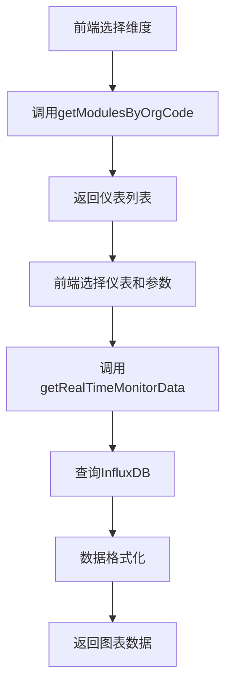

# 实时数据监控接口API文档

## 接口概览

本模块提供了能源管理系统中实时数据监控的完整接口，支持根据维度树选择仪表、查看多参数时序数据图表等功能。

## Swagger接口文档

启动应用后，可以通过以下地址访问Swagger文档：
```
http://localhost:8080/jeecg-boot/doc.html
```

在Swagger中查找 **"能源实时监控"** 标签下的接口。

## 接口详情

### 1. 根据维度获取仪表列表

```yaml
GET /energy/monitor/getModulesByOrgCode
```

**功能**: 根据维度编码获取该维度下的所有启用仪表

**参数**:
- `orgCode` (string, required): 维度编码
- `includeChildren` (boolean, optional): 是否包含子维度，默认true

**响应示例**:
```json
{
  "success": true,
  "message": "查询成功",
  "code": 200,
  "result": [
    {
      "moduleId": "yj0001_1202",
      "moduleName": "1号注塑机",
      "orgCode": "A02A02A01A01",
      "departName": "1号注塑机",
      "energyType": 1,
      "isAction": "Y"
    }
  ]
}
```

### 2. 查询实时数据

```yaml
POST /energy/monitor/getRealTimeMonitorData
```

**功能**: 查询指定仪表、参数、时间范围的实时数据

**请求体**:
```json
{
  "moduleIds": ["yj0001_1202", "yj0001_12"],
  "parameters": [1, 4, 7],
  "startTime": "2025-07-15 08:00:00",
  "endTime": "2025-07-15 16:00:00",
  "interval": 1,
  "displayMode": 1
}
```

**参数说明**:
- `moduleIds`: 仪表编号列表
- `parameters`: 参数编号列表
  - 1: A相电流
  - 2: B相电流  
  - 3: C相电流
  - 4: A相电压
  - 5: B相电压
  - 6: C相电压
  - 7: 总有功功率
  - 8: 总无功功率
  - 9: 总视在功率
  - 10: 功率因数
  - 11: 频率
  - 12: 正向有功总电能
- `startTime`: 开始时间 (yyyy-MM-dd HH:mm:ss)
- `endTime`: 结束时间 (yyyy-MM-dd HH:mm:ss)
- `interval`: 查询间隔
  - 1: 15分钟
  - 2: 30分钟
  - 3: 60分钟
  - 4: 120分钟
- `displayMode`: 显示方式
  - 1: 统一显示
  - 2: 分开显示

## 数据流程



## 技术特点

1. **时区自动处理**: 自动转换UTC和本地时间
2. **数据聚合**: 支持多种时间间隔的数据聚合
3. **灵活显示**: 支持统一显示和分开显示两种模式
4. **参数映射**: 自动映射参数编号到InfluxDB字段
5. **异常处理**: 完整的参数验证和错误处理
6. **Swagger文档**: 完整的API文档和在线测试

## 使用建议

1. **合理设置时间范围**: 避免查询过大数据量影响性能
2. **选择合适的聚合间隔**: 根据数据密度选择合适的时间间隔
3. **错误处理**: 前端应处理接口返回的错误信息
4. **缓存策略**: 对于仪表列表等相对静态的数据可以考虑缓存

## 示例代码

### JavaScript/Vue.js
```javascript
// 获取仪表列表
const getModules = async (orgCode) => {
  const response = await this.$http.get('/energy/monitor/getModulesByOrgCode', {
    params: { orgCode, includeChildren: true }
  });
  return response.data.result;
};

// 查询实时数据
const getRealTimeData = async (params) => {
  const response = await this.$http.post('/energy/monitor/getRealTimeMonitorData', params);
  return response.data.result;
};
```

### Java/Spring Boot
```java
@Autowired
private EnergyMonitorController energyMonitorController;

// 获取仪表列表
Result<List<ModuleVO>> modules = energyMonitorController.getModulesByOrgCode("A02A02A01", true);

// 查询实时数据
RealTimeDataRequest request = new RealTimeDataRequest();
request.setModuleIds(Arrays.asList("yj0001_1202"));
request.setParameters(Arrays.asList(1, 4, 7));
request.setStartTime("2025-07-15 08:00:00");
request.setEndTime("2025-07-15 16:00:00");
request.setInterval(1);
request.setDisplayMode(1);

Result<Object> data = energyMonitorController.getRealTimeMonitorData(request);
```
