# 能源分析对比功能接口文档

## 📋 功能概述

能源分析对比功能用于分析单个仪表在指定时间范围内的能源消耗情况，支持当期与同比期的对比分析，支持日、月、年三种时间粒度的统计分析。

### 核心特性
- 支持单仪表能源消耗分析
- 支持当期与同比期对比（如：2025年7月 vs 2024年7月）
- 根据能源类型自动显示对应单位（电：kWh，其他：m³）
- 提供图表和表格两种展示方式
- 支持日、月、年三种统计粒度
- 计算节能情况（基准 − 对比）

## 🗂️ 数据库表结构

### 仪表基础信息表 (tb_module)
```sql
-- 仪表表
tb_module:
  - id: 主键ID
  - module_id: 仪表编号 (如: yj0001_1202)
  - module_name: 仪表名称 (如: 1号注塑机)
  - energy_type: 能源类型 (1=电, 2=水, 3=气等)
  - sys_org_code: 维度ID列表(逗号分隔) (对应sys_depart表的id)
  - rated_power: 额定功率
  - gateway_code: 采集器名称
  - meter_id: 仪表id
  - module_type: 仪表类型
  - isaction: 是否启用 (Y/N)
```

### 维度表 (sys_depart)
```sql
-- 维度表
sys_depart:
  - id: 维度ID (如: 1881235917079482369)
  - depart_name: 维度名称 (如: 注塑部门)
  - org_code: 组织编码 (如: A02A02A01) -- 前端传递此字段
  - parent_id: 父级ID
  - org_category: 机构类别 (1公司，2组织机构，3岗位)
  - org_type: 机构类型 (1一级部门 2子部门)
```

### 统计数据表
```sql
-- 日统计表
tb_ep_equ_energy_daycount:
  - id: 主键ID
  - module_id: 仪表编号 (对应tb_module.module_id)
  - dt: 统计日期时间
  - energy_count: 能耗值
  - strat_count: 开始值
  - end_count: 结束值

-- 月统计表
tb_ep_equ_energy_monthcount:
  - id: 主键ID
  - module_id: 仪表编号 (对应tb_module.module_id)
  - dt: 统计日期时间
  - energy_count: 能耗值
  - strat_count: 开始值
  - end_count: 结束值

-- 年统计表
tb_ep_equ_energy_yearcount:
  - id: 主键ID
  - module_id: 仪表编号 (对应tb_module.module_id)
  - dt: 统计日期时间
  - energy_count: 能耗值
  - strat_count: 开始值
  - end_count: 结束值
```

## 🔌 接口设计

### 1. 根据维度获取仪表列表

#### 接口信息
- **URL**: `/energy/analysis/getModulesByDimension`
- **Method**: `GET`
- **功能**: 根据选择的维度获取对应的仪表列表

#### Controller 示例
```java
@Api(tags = "能源分析对比")
@RestController
@RequestMapping("/energy/analysis")
@Slf4j
public class EnergyAnalysisController {

    @Autowired
    private IEnergyAnalysisService energyAnalysisService;

    /**
     * 根据维度获取仪表列表
     *
     * @param orgCode 维度编码
     * @param energyType 能源类型
     * @param includeChildren 是否包含子维度
     * @return
     */
    @AutoLog(value = "能源分析-根据维度获取仪表列表")
    @ApiOperation(value = "根据维度获取仪表列表", notes = "根据维度获取仪表列表")
    @GetMapping(value = "/getModulesByDimension")
    public Result<List<ModuleVO>> getModulesByDimension(
            @RequestParam(name = "orgCode", required = true) String orgCode,
            @RequestParam(name = "energyType", required = false) Integer energyType,
            @RequestParam(name = "includeChildren", defaultValue = "false") Boolean includeChildren) {
        try {
            List<ModuleVO> modules = energyAnalysisService.getModulesByDimension(orgCode, energyType, includeChildren);
            return Result.OK(modules);
        } catch (Exception e) {
            log.error("获取仪表列表失败", e);
            return Result.error("获取仪表列表失败：" + e.getMessage());
        }
    }
}
```

#### 请求参数
- **orgCode**: String, 必填，sys_depart表的org_code (如: A02A02A01)
- **energyType**: Integer, 可选，能源类型筛选 (1=电, 2=水, 3=气等)
- **includeChildren**: Boolean, 可选，是否包含子维度，默认false

#### 响应数据
```json
{
  "success": true,
  "message": "",
  "code": 200,
  "result": [
    {
      "moduleId": "yj0001_1202",
      "moduleName": "1号注塑机",
      "energyType": 1,
      "energyTypeName": "电",
      "unit": "kWh",
      "dimensionName": "注塑部门",
      "dimensionId": "1881235917079482369",
      "gatewayCode": "yj0001_1",
      "meterId": "202",
      "ratedPower": 1000.00
    },
    {
      "moduleId": "yj0001_12",
      "moduleName": "2号注塑机",
      "energyType": 1,
      "energyTypeName": "电",
      "unit": "kWh",
      "dimensionName": "注塑部门",
      "dimensionId": "1940618841356288002",
      "gatewayCode": "yj0001_1",
      "meterId": "2",
      "ratedPower": 1000.00
    }
  ],
  "timestamp": 1691234567890
}
```

### 2. 能源分析对比数据查询

#### 接口信息
- **URL**: `/energy/analysis/getCompareData`
- **Method**: `POST`
- **功能**: 获取单个仪表的能源消耗对比数据（当期 vs 同比期）

#### Controller 示例
```java
/**
 * 能源分析对比数据查询
 *
 * @param request 查询请求参数
 * @return
 */
@AutoLog(value = "能源分析-对比数据查询")
@ApiOperation(value = "能源分析对比数据查询", notes = "获取单个仪表的能源消耗对比数据")
@PostMapping(value = "/getCompareData")
public Result<CompareDataVO> getCompareData(@RequestBody CompareDataRequest request) {
    try {
        // 参数验证
        if (StringUtils.isBlank(request.getModuleId())) {
            return Result.error("仪表ID不能为空");
        }
        if (StringUtils.isBlank(request.getTimeType())) {
            return Result.error("时间类型不能为空");
        }

        CompareDataVO compareData = energyAnalysisService.getCompareData(request);
        return Result.OK(compareData);
    } catch (Exception e) {
        log.error("获取对比数据失败", e);
        return Result.error("获取对比数据失败：" + e.getMessage());
    }
}
```

#### 请求参数 (CompareDataRequest)
```java
@Data
@ApiModel("能源分析对比查询请求")
public class CompareDataRequest {
    @ApiModelProperty(value = "仪表编号", required = true)
    private String moduleId;         // 必填，仪表编号 (tb_module.module_id)

    @ApiModelProperty(value = "时间类型", required = true)
    private String timeType;         // 必填，时间类型：day/month/year

    @ApiModelProperty(value = "基准期-开始时间", required = true)
    private String baselineStartTime; // 必填，根据 timeType：YYYY-MM-DD | YYYY-MM | YYYY

    @ApiModelProperty(value = "基准期-结束时间", required = true)
    private String baselineEndTime;   // 必填，根据 timeType：YYYY-MM-DD | YYYY-MM | YYYY

    @ApiModelProperty(value = "对比期-开始时间", required = true)
    private String compareStartTime;  // 必填，根据 timeType：YYYY-MM-DD | YYYY-MM | YYYY

    @ApiModelProperty(value = "对比期-结束时间", required = true)
    private String compareEndTime;    // 必填，根据 timeType：YYYY-MM-DD | YYYY-MM | YYYY
}
```

#### 响应数据 (CompareDataVO)
```java
@Data
@ApiModel("能源分析对比响应数据")
public class CompareDataVO {
    @ApiModelProperty("汇总数据")
    private SummaryData summary;

    @ApiModelProperty("图表数据")
    private ChartData chartData;

    @ApiModelProperty("表格数据")
    private List<TableData> tableData;

    @ApiModelProperty("仪表信息")
    private ModuleInfo moduleInfo;
}
```

#### 响应示例
```json
{
  "success": true,
  "message": "",
  "code": 200,
  "result": {
    "summary": {
      "baselineTotal": 296.37,          // 基准期总能耗
      "compareTotal": 201.74,           // 对比期总能耗
      "savingTotal": 94.63,             // 节能总量 = 基准 − 对比
      "unit": "kWh"                     // 单位
    },
    "chartData": {
      "baselineDates": ["07-26", "07-27", "07-28", "07-29", "07-30", "07-31", "08-01", "08-02"],
      "compareDates": ["07-26", "07-27", "07-28", "07-29", "07-30", "07-31", "08-01", "08-02"],
      "series": [
        { "name": "基准期", "type": "line", "data": [289, 283, 299, 250, 240, 180, 190, 200], "unit": "kWh" },
        { "name": "对比期", "type": "line", "data": [250, 260, 283, 220, 200, 150, 170, 180], "unit": "kWh" },
        { "name": "节能情况", "type": "bar",  "data": [39, 23, 16, 30, 40, 30, 20, 20], "unit": "kWh" }
      ]
    },
    "tableData": [
      {
        "baselineDate": "2025-07-04",
        "baselineValue": 437102.40,
        "compareDate": "2024-07-04",
        "compareValue": 401454.20,
        "saving": "节约 35,648.20 kWh"
      }
    ],
    "moduleInfo": {
      "moduleId": "yj0001_1202",
      "moduleName": "1号注塑机",
      "energyType": 1,
      "unit": "kWh",
      "dimensionName": "注塑部门"
    }
  },
  "timestamp": 1691234567890
}
```

### 3. 获取能源类型配置

#### 接口信息
- **URL**: `/energy/analysis/getEnergyTypes`
- **Method**: `GET`
- **功能**: 获取系统支持的能源类型配置

#### Controller 示例
```java
/**
 * 获取能源类型配置
 *
 * @return
 */
@AutoLog(value = "能源分析-获取能源类型配置")
@ApiOperation(value = "获取能源类型配置", notes = "获取系统支持的能源类型配置")
@GetMapping(value = "/getEnergyTypes")
public Result<List<EnergyTypeVO>> getEnergyTypes() {
    try {
        List<EnergyTypeVO> energyTypes = energyAnalysisService.getEnergyTypes();
        return Result.OK(energyTypes);
    } catch (Exception e) {
        log.error("获取能源类型配置失败", e);
        return Result.error("获取能源类型配置失败：" + e.getMessage());
    }
}
```

#### 响应数据
```json
{
  "success": true,
  "message": "",
  "code": 200,
  "result": [
    {
      "energyType": 1,
      "energyTypeName": "电",
      "unit": "kWh",
      "icon": "electric"
    },
    {
      "energyType": 2,
      "energyTypeName": "水",
      "unit": "m³",
      "icon": "water"
    },
    {
      "energyType": 3,
      "energyTypeName": "气",
      "unit": "m³",
      "icon": "gas"
    }
  ],
  "timestamp": 1691234567890
}
```

## 💾 数据处理逻辑

### 1. 仪表筛选逻辑
```sql
-- 第一步：根据org_code获取维度ID
SELECT id, depart_name, parent_id
FROM sys_depart
WHERE org_code = #{orgCode}

-- 第二步：如果includeChildren=true，获取所有子维度ID
WITH RECURSIVE depart_tree AS (
  SELECT id, depart_name, parent_id, org_code
  FROM sys_depart
  WHERE org_code = #{orgCode}

  UNION ALL

  SELECT d.id, d.depart_name, d.parent_id, d.org_code
  FROM sys_depart d
  INNER JOIN depart_tree dt ON d.parent_id = dt.id
)
SELECT id FROM depart_tree;

-- 第三步：根据维度ID获取仪表列表
SELECT m.module_id, m.module_name, m.energy_type, m.rated_power,
       m.gateway_code, m.meter_id,
       MAX(d.depart_name) AS dimension_name,
       MAX(d.id) AS dimension_id
FROM tb_module m
LEFT JOIN sys_depart d ON FIND_IN_SET(d.id, m.sys_org_code)
WHERE m.isaction = 'Y'  -- 只查询启用的仪表
  AND (#{energyType} IS NULL OR m.energy_type = #{energyType})  -- 可选筛选条件
  AND (
      /* 维度ID列表用 OR + FIND_IN_SET 逐一匹配 */
      FIND_IN_SET(#{dimensionIds[0]}, m.sys_org_code)
      /* OR FIND_IN_SET(#{dimensionIds[1]}, m.sys_org_code) ... */
  )
GROUP BY m.module_id, m.module_name, m.energy_type, m.rated_power, m.gateway_code, m.meter_id
ORDER BY m.module_id
```

### 2. 统计数据查询逻辑

#### 日统计查询
```sql
-- 基准期（日）
SELECT module_id, DATE(dt) as stat_date, energy_count
FROM tb_ep_equ_energy_daycount
WHERE module_id = #{moduleId}
  AND DATE(dt) BETWEEN #{baselineStartTime} AND #{baselineEndTime}
ORDER BY dt ASC;

-- 对比期（日）
SELECT module_id, DATE(dt) as stat_date, energy_count
FROM tb_ep_equ_energy_daycount
WHERE module_id = #{moduleId}
  AND DATE(dt) BETWEEN #{compareStartTime} AND #{compareEndTime}
ORDER BY dt ASC;
```

#### 月统计查询
```sql
-- 基准期（月）
SELECT module_id, DATE_FORMAT(dt, '%Y-%m') as stat_month, energy_count
FROM tb_ep_equ_energy_monthcount
WHERE module_id = #{moduleId}
  AND DATE_FORMAT(dt, '%Y-%m') BETWEEN #{baselineStartTime} AND #{baselineEndTime}
ORDER BY dt ASC;

-- 对比期（月）
SELECT module_id, DATE_FORMAT(dt, '%Y-%m') as stat_month, energy_count
FROM tb_ep_equ_energy_monthcount
WHERE module_id = #{moduleId}
  AND DATE_FORMAT(dt, '%Y-%m') BETWEEN #{compareStartTime} AND #{compareEndTime}
ORDER BY dt ASC;
```

#### 年统计查询
```sql
-- 基准期（年）
SELECT module_id, YEAR(dt) as stat_year, energy_count
FROM tb_ep_equ_energy_yearcount
WHERE module_id = #{moduleId}
  AND YEAR(dt) BETWEEN #{baselineStartTime} AND #{baselineEndTime}
ORDER BY dt ASC;

-- 对比期（年）
SELECT module_id, YEAR(dt) as stat_year, energy_count
FROM tb_ep_equ_energy_yearcount
WHERE module_id = #{moduleId}
  AND YEAR(dt) BETWEEN #{compareStartTime} AND #{compareEndTime}
ORDER BY dt ASC;
```

### 3. 同比数据计算

#### 日同比
- 当期：2025-07-26 ~ 2025-08-02
- 同比期：2024-07-26 ~ 2024-08-02

#### 月同比
- 当期：2025-07
- 同比期：2024-07

#### 年同比
- 当期：2025
- 同比期：2024

### 4. 节能计算口径
- 差值(delta) = 基准能耗 − 对比能耗
- delta > 0：节约（绿色显示）
- delta < 0：超出（红色显示）
- 表格“节能情况”与图表柱状“节能情况”一致


## 🎨 前端展示规范

### 1. 单位显示规则
```javascript
// 根据能源类型显示单位
const getUnit = (energyType) => {
  switch(energyType) {
    case 1: return 'kWh';  // 电
    case 2: return 'm³';   // 水
    case 3: return 'm³';   // 气
    default: return 'm³';
  }
}
```

### 2. 图表配置
```javascript
// ECharts 配置：基准期(折线) + 对比期(折线) + 节能情况(柱状)
// 说明：
// - 差值delta = 基准期 - 对比期
// - delta > 0 表示节约(绿色)；delta < 0 表示超出(红色)
const categories = baselineDates; // 基准期时间序列
const unit = 'kWh';
const chartOption = {
  title: { text: '能源消耗对比' },
  tooltip: {
    trigger: 'axis',
    formatter: function (params) {
      const idx = params[0].dataIndex;
      const bDate = baselineDates[idx] || '-';
      const cDate = compareDates[idx] || '-';
      const bVal  = params.find(p=>p.seriesName==='基准期')?.value ?? null;
      const cVal  = params.find(p=>p.seriesName==='对比期')?.value ?? null;
      const dVal  = (bVal==null||cVal==null)? null : (bVal - cVal);
      const tag   = dVal==null? '' : (dVal>=0? '节约' : '超出');
      const color = dVal==null? '#999' : (dVal>=0? '#52c41a' : '#ff4d4f');
      return [
        `基准时间：${bDate}`,
        `基准能耗：${bVal?.toLocaleString()} ${unit}`,
        `对比时间：${cDate}`,
        `对比能耗：${cVal?.toLocaleString()} ${unit}`,
        `<span style="color:${color}">${tag}：${Math.abs(dVal||0).toLocaleString()} ${unit}</span>`
      ].join('<br/>');
    }
  },
  legend: { data: ['基准期', '对比期', '节能情况'] },
  xAxis: { type: 'category', data: categories },
  yAxis: { type: 'value', name: unit, axisLabel: { formatter: '{value} ' + unit } },
  series: [
    { name: '基准期', type: 'line', smooth: true, data: baselineValues },
    { name: '对比期', type: 'line', smooth: true, data: compareValues },
    { name: '节能情况', type: 'bar', data: baselineValues.map((v,i)=> (v ?? 0) - (compareValues[i] ?? 0)),
      itemStyle: { color: function(p){ return (p.value>=0)? '#52c41a' : '#ff4d4f'; } } }
  ]
};
```

### 3. 表格配置（与页面一致）
```javascript
// 表格列：基准时间 | 基准能耗(kWh) | 对比时间 | 对比能耗(kWh) | 节能情况
const unit = 'kWh';
const tableColumns = [
  { title: '基准时间', dataIndex: 'baselineDate', key: 'baselineDate', width: 120 },
  { title: `基准能耗(${unit})`, dataIndex: 'baselineValue', key: 'baselineValue',
    render: v => (v==null? '--' : v.toLocaleString()) },
  { title: '对比时间', dataIndex: 'compareDate', key: 'compareDate', width: 120 },
  { title: `对比能耗(${unit})`, dataIndex: 'compareValue', key: 'compareValue',
    render: v => (v==null? '--' : v.toLocaleString()) },
  { title: '节能情况', dataIndex: 'savingText', key: 'savingText',
    render: (_, row) => {
      const delta = (row.baselineValue ?? 0) - (row.compareValue ?? 0); // 基准-对比
      const tag = delta >= 0 ? '节约' : '超出';
      const color = delta >= 0 ? '#52c41a' : '#ff4d4f';
      return <span style={{ color }}>{tag} {Math.abs(delta).toLocaleString()} {unit}</span>;
    }
  }
];

// 将接口返回转换为表格行（基准期为横轴）
const rows = baselineValues.map((bv, i) => ({
  key: i,
  baselineDate: baselineDates[i],
  baselineValue: bv,
  compareDate: compareDates[i] || null,
  compareValue: compareValues[i] || null,
}));
```

## 🔄 业务流程

### 1. 页面初始化流程

```mermaid
graph TD
    A[页面加载] --> B[获取能源类型配置]
    B --> C[初始化维度树]
    C --> D[等待用户选择维度]
    D --> E[获取对应仪表列表]
    E --> F[用户选择仪表和时间]
    F --> G[查询对比数据]
    G --> H[渲染图表和表格]
```


### 2. 数据查询流程

```mermaid
graph TD
    A[接收查询参数] --> B[参数验证]
    B --> C[确定统计表类型]
    C --> D{时间类型}
    D -->|day| E[查询日统计表]
    D -->|month| F[查询月统计表]
    D -->|year| G[查询年统计表]
    E --> H[计算同比数据]
    F --> H
    G --> H
    H --> I[数据聚合处理]
    I --> J[返回结果]
```


## 📝 接口测试用例

### 1. 获取仪表列表测试
```http
GET /energy/analysis/getModulesByDimension?orgCode=A02A02A01&energyType=1&includeChildren=true

# 响应示例
{
  "success": true,
  "code": 200,
  "result": [
    {
      "moduleId": "yj0001_1202",
      "moduleName": "1号注塑机",
      "energyType": 1,
      "energyTypeName": "电",
      "unit": "kWh"
    }
  ]
}
```

### 2. 日对比数据查询测试
```http
POST /energy/analysis/getCompareData
Content-Type: application/json

{
  "moduleId": "yj0001_1202",
  "timeType": "day",
  "baselineStartTime": "2025-07-03",
  "baselineEndTime": "2025-07-13",
  "compareStartTime": "2024-07-03",
  "compareEndTime": "2024-07-13"
}

# 响应示例
{
  "success": true,
  "code": 200,
  "result": {
    "summary": {
      "totalConsumption": 296.37,
      "growthRate": 31.93,
      "unit": "kWh"
    }
  }
}
```

### 3. 月对比数据查询测试
```http
POST /energy/analysis/getCompareData
Content-Type: application/json

{
  "moduleId": "yj0001_1202",
  "timeType": "month",
  "baselineStartTime": "2025-01",
  "baselineEndTime": "2025-07",
  "compareStartTime": "2024-01",
  "compareEndTime": "2024-07"
}
```

### 4. 年对比数据查询测试
```http
POST /energy/analysis/getCompareData
Content-Type: application/json

{
  "moduleId": "yj0001_1202",
  "timeType": "year",
  "baselineStartTime": "2023",
  "baselineEndTime": "2025",
  "compareStartTime": "2020",
  "compareEndTime": "2022"
}
```

### 5. 涂装部门仪表查询测试
```http
GET /energy/analysis/getModulesByDimension?orgCode=A02A02A04&includeChildren=false
```

### 6. 包装部门仪表查询测试
```http
GET /energy/analysis/getModulesByDimension?orgCode=A02A02A05&includeChildren=false
```

### 7. 错误处理测试
```http
# 参数缺失测试
POST /energy/analysis/getCompareData
Content-Type: application/json

{
  "moduleId": "",
  "timeType": "day"
}

# 响应示例
{
  "success": false,
  "code": 500,
  "message": "仪表ID不能为空"
}
```

## ⚠️ 注意事项

### 1. 数据关联关系
- **重要**：前端传递的是 `sys_depart.org_code`，后端需要先查询获取对应的 `sys_depart.id`
- `tb_module.sys_org_code` 字段保存的是逗号分隔的 `sys_depart.id` 列表，不是 `org_code`；查询需使用 `FIND_IN_SET(id, sys_org_code)` 逐一匹配
- 查询仪表时必须使用 `sys_depart.id` 进行关联
- 接口处理流程：`org_code` → `sys_depart.id` → `tb_module` 仪表列表

### 2. 能源类型和单位
```javascript
// 能源类型映射
const ENERGY_TYPE_MAP = {
  1: { name: '电', unit: 'kWh' },
  2: { name: '水', unit: 'm³' },
  3: { name: '气', unit: 'm³' },
  // 其他能源类型默认使用 m³
};
```

### 3. 时间格式规范
- **日统计**: `YYYY-MM-DD` (如: 2025-07-26)，数据库字段 `dt` 为 datetime 类型
- **月统计**: `YYYY-MM` (如: 2025-07)，从 `dt` 字段提取年月
- **年统计**: `YYYY` (如: 2025)，从 `dt` 字段提取年份

### 4. 数据精度处理
- 能耗数据 `energy_count` 为 decimal(18,2) 类型，保留2位小数
- 节能情况数值保留2位小数
- 大数值使用千分位分隔符显示
- 开始值 `strat_count` 和结束值 `end_count` 也为 decimal(18,2) 类型

### 5. 异常处理
```javascript
// 数据为空时的处理
if (!data || data.length === 0) {
  return {
    success: true,
    result: {
      summary: { baselineTotal: 0, compareTotal: 0, savingTotal: 0, unit },
      chartData: { baselineDates: [], compareDates: [], series: [] },
      tableData: []
    }
  };
}

// 数据缺失时处理
// 若某天/某月无数据，显示为 "--"，节能情况计算时按0处理
```

### 6. 性能优化建议
- 大时间范围查询时考虑分页
- 单仪表查询时添加索引优化
- 缓存能源类型配置数据
- 图表数据点过多时考虑数据抽样

## 🚀 扩展功能与导出规范

### 1. 导出对比数据（Excel）

#### 1.1 接口信息
- URL: `/energy/analysis/exportCompareData`
- Method: `GET`
- Auth: 需要登录，建议权限码：`energy:analysis:export`
- 功能：导出当前查询条件下的“基准 vs 对比”数据为 Excel

#### 1.2 请求参数（QueryString）
- `moduleId` String 必填，仪表编号（tb_module.module_id）
- `timeType` String 必填，`day|month|year`
- `baselineStartTime` String 必填，根据 timeType：`YYYY-MM-DD|YYYY-MM|YYYY`
- `baselineEndTime` String 必填，根据 timeType：`YYYY-MM-DD|YYYY-MM|YYYY`
- `compareStartTime` String 必填，根据 timeType：`YYYY-MM-DD|YYYY-MM|YYYY`
- `compareEndTime` String 必填，根据 timeType：`YYYY-MM-DD|YYYY-MM|YYYY`
- `orgCode` String 可选，仅用于导出标题/参数区展示（不参与统计）

示例：
- `GET /energy/analysis/exportCompareData?moduleId=yj0001_1202&timeType=day&baselineStartTime=2025-07-03&baselineEndTime=2025-07-13&compareStartTime=2024-07-03&compareEndTime=2024-07-13`

#### 1.3 返回
- Content-Type: `application/vnd.openxmlformats-officedocument.spreadsheetml.sheet`
- Content-Disposition: `attachment; filename="能源对比_1号注塑机_日_基准2025-07-03~2025-07-13_对比2024-07-03~2024-07-13_20250811-213000.xlsx"`
- Body: Excel 二进制流

#### 1.4 Excel 文件结构（结合前端视觉）
- Sheet1：`概览`
  - 参数区：维度(orgCode/名称)、仪表、时间范围、统计粒度、导出时间
  - 指标卡：
    - 基准用量（kWh）
    - 对比用量（kWh）
    - 节能量（kWh） = 基准用量 − 对比用量
    - 节能率（%） = (节能量 ÷ 基准用量) × 100
  - 说明：单位随能源类型映射（电=kWh，水/气=m³）
- Sheet2：`趋势对比`
  - 列：时间、基准用量(单位)、对比用量(单位)
  - 可选：生成折线图（基准线、对比线），图例同前端
- Sheet3：`对比明细`
  - 列：
    1) 时间
    2) 基准用量(单位)
    3) 对比用量(单位)
    4) 节能量(单位) = 基准 − 对比
    5) 节能率(%) = (节能量 ÷ 基准) × 100
  - 底部：合计行（基准总、对比总、节能量总）与平均行（节能率平均）

格式要求：
- 数值统一千分位+保留2位小数；节能率保留2位并带 %
- 当基准用量为 0 时，节能率显示 `--`
- 负数值（用量下降/节能为负）用绿色；正数用红色（与前端一致）

#### 1.5 服务端实现要点（Jeecg 推荐写法）
- 使用 AutoPoi 导出：`JeecgEntityExcelView` + `NormalExcelConstants`
- 大数据量使用 `SXSSFWorkbook` 流式写入，分页拉取（建议每页 5k-10k）
- 文件命名：`能源对比_{moduleName}_{粒度}_基准{B开始~B结束}_对比{C开始~C结束}_{yyyyMMdd-HHmm}.xlsx`
- 统一单位：按 energyType 使用 kWh/m³；标题与列名需动态带单位
- 计算口径与前端一致：基准=基准期；对比=对比期；节能量=基准−对比，节能率=节能量÷基准

示例导出实体（仅文档说明）：
```java
@Data
public class CompareExportRow {
  @Excel(name = "时间", width = 18)
  private String date;
  @Excel(name = "基准用量(${unit})", numFormat = "#,##0.00")
  private BigDecimal currentConsumption;
  @Excel(name = "对比用量(${unit})", numFormat = "#,##0.00")
  private BigDecimal previousConsumption;
  @Excel(name = "节能量(${unit})", numFormat = "#,##0.00")
  private BigDecimal saving;
  @Excel(name = "节能率(%)", numFormat = "0.00")
  private BigDecimal savingRate;
}
```

#### 1.6 前端对接（Vue3 示例）
```ts
// 点击“导出”
const onExport = async () => {
  const params = { moduleId, timeType, baselineStartTime, baselineEndTime, compareStartTime, compareEndTime };
  const url = baseURL + '/energy/analysis/exportCompareData';
  const res = await axios.get(url, { params, responseType: 'blob' });
  const disposition = res.headers['content-disposition'] || '';
  const match = /filename\*=UTF-8''([^;]+)|filename="?([^";]+)"?/i.exec(disposition);
  const filename = decodeURIComponent(match?.[1] || match?.[2] || `能源对比_${Date.now()}.xlsx`);
  const blob = new Blob([res.data], { type: 'application/vnd.openxmlformats-officedocument.spreadsheetml.sheet' });
  // file-saver
  saveAs(blob, filename);
};
```

#### 1.7 接口测试
```http
GET /energy/analysis/exportCompareData?moduleId=yj0001_1202&timeType=day&baselineStartTime=2025-07-03&baselineEndTime=2025-07-13&compareStartTime=2024-07-03&compareEndTime=2024-07-13
Accept: application/vnd.openxmlformats-officedocument.spreadsheetml.sheet
```


---

## 🏗️ Service 层设计

### IEnergyAnalysisService 接口
```java
public interface IEnergyAnalysisService {

    /**
     * 根据维度获取仪表列表
     */
    List<ModuleVO> getModulesByDimension(String orgCode, Integer energyType, Boolean includeChildren);

    /**
     * 获取能源分析对比数据
     */
    CompareDataVO getCompareData(CompareDataRequest request);

    /**
     * 获取能源类型配置
     */
    List<EnergyTypeVO> getEnergyTypes();
}
```

### 实现类示例
```java
@Service
@Slf4j
public class EnergyAnalysisServiceImpl implements IEnergyAnalysisService {

    @Autowired
    private TbModuleMapper moduleMapper;

    @Autowired
    private SysDepartMapper departMapper;

    @Override
    public List<ModuleVO> getModulesByDimension(String orgCode, Integer energyType, Boolean includeChildren) {
        // 1. 根据orgCode获取维度ID
        List<String> dimensionIds = getDimensionIds(orgCode, includeChildren);

        // 2. 查询仪表列表
        return moduleMapper.selectModulesByDimensionIds(dimensionIds, energyType);
    }

    @Override
    public CompareDataVO getCompareData(CompareDataRequest request) {
        // 根据timeType选择对应的统计表进行查询
        switch (request.getTimeType()) {
            case "day":
                return getDayCompareData(request);
            case "month":
                return getMonthCompareData(request);
            case "year":
                return getYearCompareData(request);
            default:
                throw new IllegalArgumentException("不支持的时间类型: " + request.getTimeType());
        }
    }
}
```

## 📚 相关文档
- [JeecgBoot开发文档](http://help.jeecg.com/java/)
- [JeecgBoot接口规范](http://help.jeecg.com/java/qa/)
